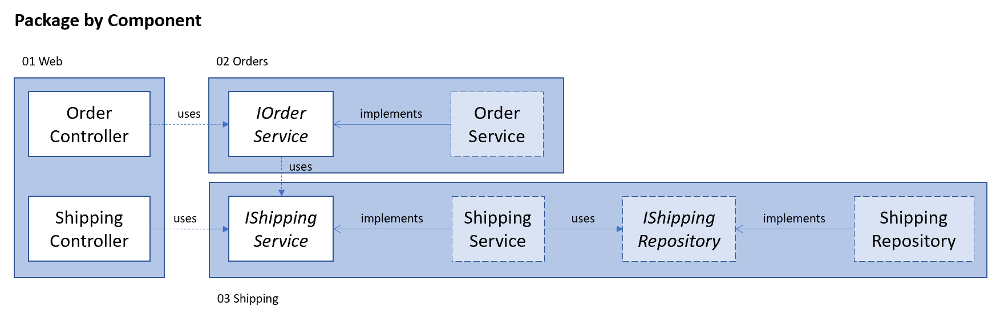

[Home](../README.md)  
Previous: [Feature](../Sliced/README.md)

---

# Package by Component

The package-by-component style is similar to the package-by-feature style.
Like in the package-by-feature, the packages do not reflect the technical layers, but instead a part of functionality. Unlike that style, the packages do not contain the applications entry point (the controllers).

## Structure
In this demo, the solution consists out of three packages.

1. Web - startup project and it contains the controllers for the Orders and Shipping packages
2. Orders
3. Shipping

New functionality and dependency injection is done in a similar fashion as the [package-by-feature](../Sliced/README.md) style. The major difference is that in this style a new controller is added to the Web package.

## Advantages
This style has similar advantages as the [package-by-feature](../Sliced/README.md) style, namely the similaries to a Domain-Driven Design model, encapsulation and flexibility.

### Shared Logic
One advantage over the package-by-feature style, is that services can easily be re-used in other packages. This might reduce the need to extract logic into a shared library. However, it might also introduce unintended coupling between packages.

## Disadvantages
In my opinion, the only disadvantage is the difficulty to test components that rely on 3rd party services such as databases or payment platforms. This drawback is already in described in [package-by-feature](../Sliced/README.md), so I won't go into further detail here.

---

[Home](../README.md)  
Previous: [Feature](../Sliced/README.md)
