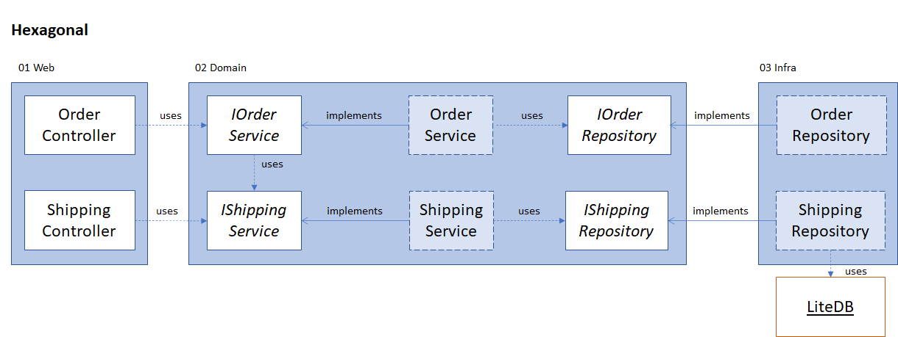

[Home](../README.md)  
Previous: [Layered](../Layered/README.md)  
Next: [Feature](../Sliced/README.md)

---

# Hexagonal

The hexagonal style is similar to the package-by-layer style. It also prescribes three layers, usually named _Application_, _Core_ or _Domain_ and _Infrastructure_.
The responsibilities of these three layers is the same as in the package-by-layer style, but the difference lies in the position of the interfaces.

The hexagonal style, with relation to the package-by-layer style, moves the interfaces to the middle layer.

## Structure
The solution consists out of three projects representing the layers. Each layer depends on the interfaces of the next.

1. Web
2. Domain
3. Infrastructure

Functionality is added in a similar fashion as the package-by-layer style: creating more controllers in the Web project, more services in the Services project and more repositories in the Infrastructure project.

Concrete implementations are injected by registering them on the IServiceCollection via extensions defined in each layer. This way the concrete implementations can stay internal.

### Alternative structure
Alternatively, we could package classes first by subdomain and then by layer.

Unfortunately, C# does not allow to create packages inside packages. They could be separate solutions, but then dependencies can only be fulfilled by importing them as (NuGet) packages.
If we only create projects/packages for the subdomains, then we lose the possibility to enforce encapsulation inside each layer. This might not be a bad thing, but then the style starts to look more like a  architecture.

## Advantages
The initial structure, with one package per layer, is still easy to understand and extend. Every 'type' of class (controller, service, repository) has a single place to go. The idea of placing the interface inside core might be confusing at first.

### Dependency Inversion
The primary advantage of this style is the inversion of the dependency between the domain and infrastructure layer. The domain layer defines the interfaces of anything it might depend on. While technically this is only a move operation, this mindset can help creating stabler interfaces for the domain.

When the client (they who use the interface) define the interface. It will contain precisely what the client needs and it will be defined with classes the client already knows about. If the package that contains the implementation also defines the interface, then it is more likely to change when the implementation changes.

> ##### Sidebar
> Defining interfaces on the client-side is not always better. Defining them on the implementation-side is more useful if it's a generic library that will be re-used in other projects.

### Testability
Like in the package-by-layer style, testing is easy as the repository interfaces are exposed. In addition to the [described advantage](../Layered/README.md), another benefit is that the domain test project no longer has a dependency on the infrastructure layer.

## Disadvantages
Unfortunately, this style does not solve the lack of (enforced) encapsulation the package-by-layer style has. It is just as easy to create tightly-coupled components. For more information see the description of the [package-by-layer](../Layered/README.md) style.

---

[Home](../README.md)  
Previous: [Layered](../Layered/README.md)  
Next: [Feature](../Sliced/README.md)
