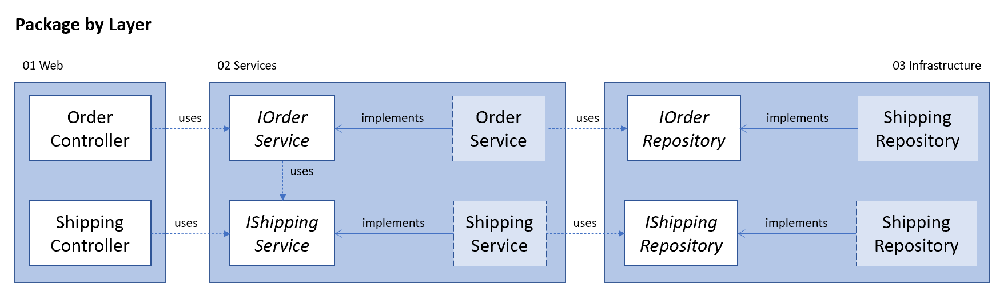

# Package by Layer

This style packages the classes by their technological layer (Presentation, Services and Infrastructure).

## Structure
The solution consists out of three projects representing the layers. Each layer depends on the interfaces of the next.

1. Web
2. Services
3. Infrastructure

Functionality is added by creating more controllers in the Web project, more services in the Services project and more repositories in the Infrastructure project.

Concrete implementations are injected by registering them on the IServiceCollection via extensions defined in each layer. This way the concrete implementations can stay internal.

## Advantages
This style is really easy to understand and extend. Every 'type' of class (controller, service, repository) has a single place to go.

### Testability
The interfaces of the repositories are public. This allows test projects to create test doubles (mocks and stubs) of the repositories.

Test doubles are especially useful when the actual 'infrastructure' (database, message queue, 3rd party payment provider) doesn't provide a way to easily setup a sandbox environment. 
Removing the dependency on them also ensures that unit tests cannot fail because of any errors on the side of the dependency.

## Disadvantages
While easy to understand, it is also easier to create tightly coupled components.

### Encapsulation
Each layer only exposes their interfaces. As the interfaces are packaged by layer, this means that any controller can directly access repositories. This is not a bad thing per se, but it can create a more complicated dependency graph.

A bigger issue is that the models, services and repositories of the _Order_ subdomain can directly access the models, services and repositories of the _Shipping_ subdomain. This creates a tight coupling between these two subdomains. For example, the order service needs to create the shipment. The shipping service requests the entire order model, while it only needs the order ID.

This solution displays these issues as it is a common pitfall. One could resolve them by moving responsibilities and thinking carefully about the data shared between services. The architectural style unfortunately does not aid the developer in these decisions.
