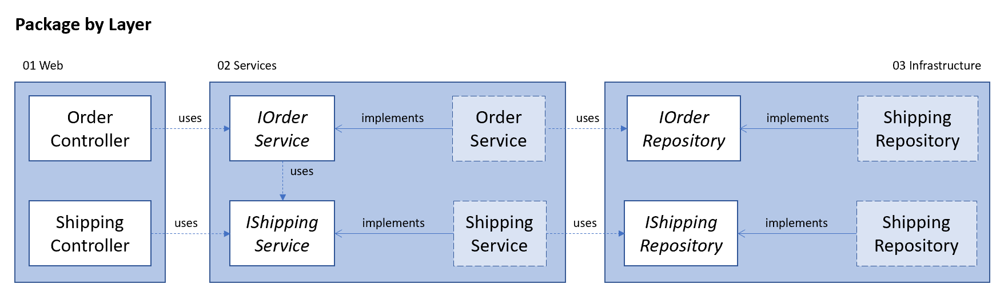
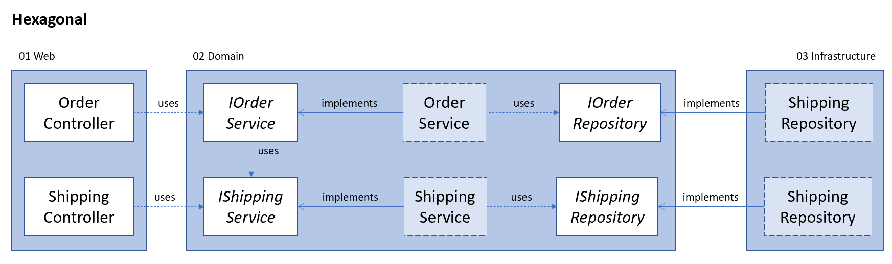
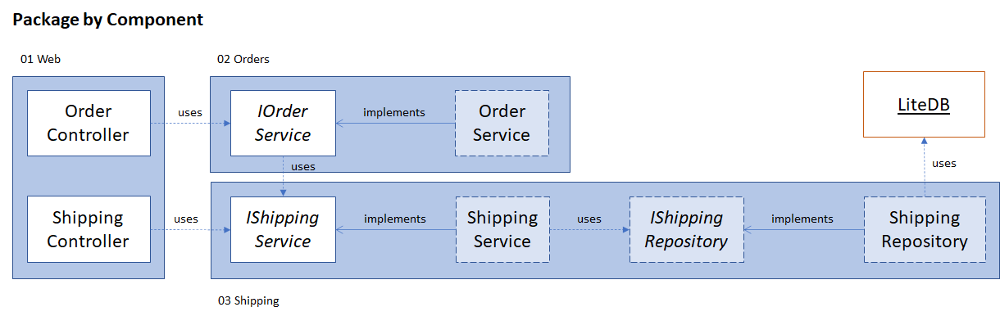

# Architectural Styles
This repository displays a simple web API in four different architectural styles.
The purpose is to show what they look like, not to prove that one is better than the other.
Arguably, none of these styles are appropriate for the size of this demonstration.

## Requirements
The web API needs to support the following behavior:
- Place a new order
- Retrieve the status of the shipment related to the placed order

The source code also needs to be testable.

## Styles
The following styles are demonstrated in this repository:

### [Package by Layer](./Layered/README.md)
This style packages the classes by their technological layer (Presentation, Services and Infrastructure).

### [Hexagonal](./Hexagonal/README.md)
This style packages the classes by their technological layer (Presentation, Services and Infrastructure), but inverses the dependency between the services and the infrastructure.

### [Package by Feature](./Sliced/README.md)
This style packages the classes by functionality (or feature).

### [Package by Component](./Component/README.md)
This style packages the classes by functionality (or feature), but puts application entry points in a separate package.

## Remarks
The implementations are not optimal, many of the flaws can be solved without changing the architecture. InsteadI chose to show patterns that I have experienced and read about when using the architectural styles.

In the end, these are just architectural patterns, they do not put hard restrictions on the final implementation. They do have certain [affordances](https://sandimetz.com/blog/2018/21/what-does-oo-afford). Depending on the chosen architecture, certain patterns/issues are more likely to arise than others.

Also, in more complicated applications, I would personally use an in-process event bus so that the _OrderService_ no longer has a dependency on the _ShippingService_. Instead, it's the _Shipping_ domain's responsibility to know when an order is placed and to create the shipment. This also makes it easier to create separate units of deployment from these two domains.

For more information about these styles and the ins and outs of them, I recommend watching Simon Brown's [Modular Monolith](https://www.youtube.com/watch?v=5OjqD-ow8GE) talk.

His blog post about [Architecturally Aligned Testing](http://www.codingthearchitecture.com/2015/03/08/package_by_component_and_architecturally_aligned_testing.html) is also a great read and touches the subject of unit testing vertical slices/components. While I recommend reading the article, the short version is that you should not shoe-horn your entire project into one of these styles. "If you have a component that is sending asynchronous messages or using an external, third-party service, you'll probably still need to consider adding dependency injection points (e.g. ports and adapters) to adequately test the component".

In my opinion, the package-by-component style is the most flexible, but for smaller projects the package-by-layer is probably easier to setup. If you also want to enforce dependencies inside a component (e.g., when you apply a hexagonal architecture inside the component), then a static code analyzer such as [NsDepCop](https://github.com/realvizu/NsDepCop) can be used.

## Questions?
If you have any questions or feel like certain things are mispresented. Feel free to open an issue or a PR!
