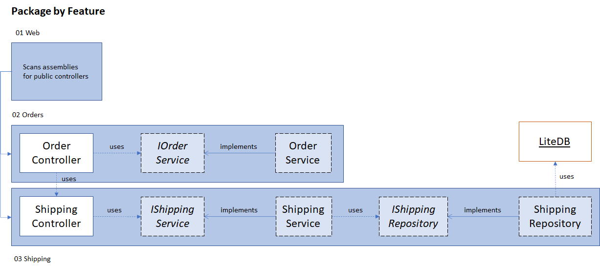

# Package by Feature

The package-by-feature style is different from the package-by-layer and hexagonal styles.
The packages no longer reflect the technical concerns. Instead, they reflect the different features.

Each package is responsible for defining their part of the applications public API (in this demo, the controllers) and third party integrations (formerly the infrastructure layer).

## Structure
In this demo, the solution consists out of three packages.

1. Web - startup project, scans the other packages for controllers.
2. Orders
3. Shipping

New functionality is added by creating a separate package. For example, functionality regarding a store's warehouse would go into a package called '04 Warehouse'.

As dependency injection is configured in the startup project, we can use the same technique as the other styles. Concrete implementations are injected by registering them on the IServiceCollection via extensions defined in each package.

## Advantages
While this style has been gaining popularity, it can be confusing. The startup package does not define any controllers and it's likely that there will be a debate on how to handle shared logic.

### Domain-Driven Design
The various slices can refer to the bounded contexts in a Domain-Driven Design. This makes the structure reflect the problems the business needs to solve. This is useful, especially when the model is documented. The code then has fewer discrepancies (if any) with the documentation.

### Encapsulation
The various packages encapsulate their behaviour, guiding developers which services are allowed to depend on each other. For example, the Order service can no longer depend on the Shipping service as it is now internal to the Shipping package.

In this (contrived) example, the difference is minute. However, one distinction can already be seen. We only pass the order id to the Shipping package as opposed to creating a shipment inside our Order service. This was the easier choice as the Order package does not contain a Shipment model. If one would be created, it would look out of place.

An alternative implementation would be sending a message from the Order package that the Shipping package would listen to. Inverting this dependency is especially useful if we just need to inform other subdomains and do not require immediate information from them. It also puts the responsibility of gathering the right information to create shipment in the Shipping subdomain. Usually, if it's a direct API call, the API expects sufficient information to perform the operation (i.e., creating the shipment).

### Flexibility
Each feature-package can organize their code as they see fit. A very simple feature could handle everything in the controller. A more complicated feature could organize the code in a hexagonal fashion. To sustain the advantage of encapsulation, however, it's important that the repository and service interfaces remain internal.

## Disadvantages
This style has two major disadvantages: 

1. it can be difficult to test, as everything is hidden behind the controller
2. shared logic has no place in this style (if you follow it dogmatically)

### Testability
Unlike the package-by-layer and hexagonal styles, the package-by-feature style does not expose the repository interfaces. This makes unit testing the package more difficult. When the implementation does not support a kind of sandbox environment (e.g. in-memory database), then an integration test is required. This is not bad per se, but integration tests typically run slower and it's less obvious whether the error lies in our logic or the system we are connecting to.

This demo does not suffer from this issue, as LiteDB can be configured to run in-memory.

Alternatively, you can use [friend assemblies](https://docs.microsoft.com/en-us/dotnet/standard/assembly/friend) to expose the internal of the to-be-tested package to the respective test package. This allows you to mock the internal interfaces. But be careful! This also allows you to write tests against possible implementation details.

Another approach is to use a static dependency analyzer (such as [NsDepCop](https://github.com/realvizu/NsDepCop)) to raise errors when certain namespaces depend on other specific namespaces. This way, you can make the interface public, but only allow the test package to reference them.

### Shared Logic
Sharing logic without breaking encapsulation can only be done by creating a separate package on which both feature-packages depend. This is a common and decent approach, but slightly deviates from the idea that every package contains an application entry point (e.g., controller). I believe an application should not have to follow one single style of architecture. As long as it's clear to any contributor what style is used and how they can extend the application.

One challenge with a shared library, is providing a solid public API while encapsulating the implementation.
